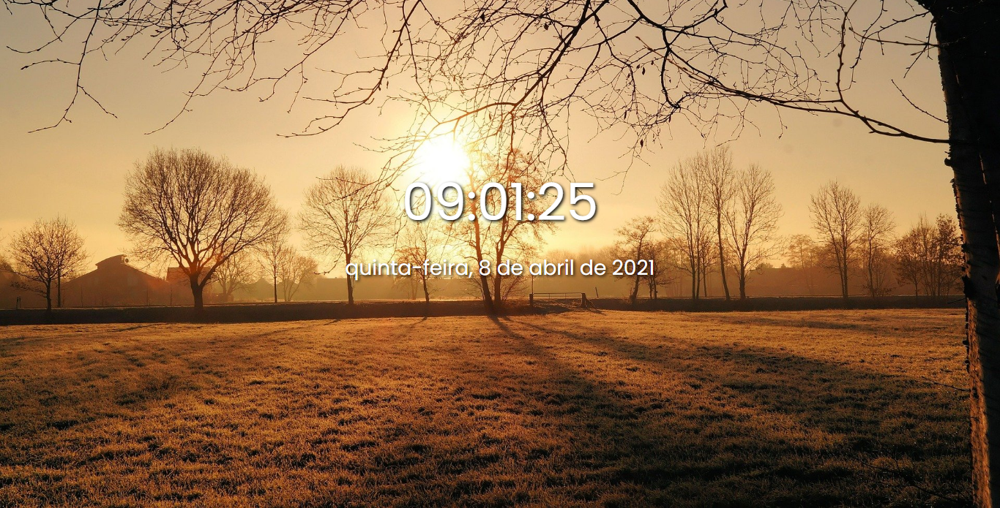

<h1 align="center">time of day 🕐</h1>

<h2 align="center">the background image change according to the time</h2>

 

### background image on computers

<h3 align="center" margin="20px">Morning image </h3>
 

    

<h3 align="center"> Afternoon image </h3>
 

    

<h3 align="center"> Night image </h3>
 

    

### background on mobile devices

<h3 align="center"> Morning image </h3>
 

    

<h3 align="center"> Afternoon image </h3>
 

    

<h3 align="center"> Night image </h3>
 

    

